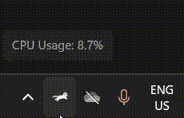
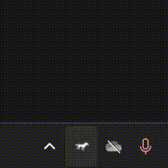

# 🐱 RunnerCat

**RunnerCat** is a lightweight and charming system tray utility for **Windows**, inspired by [RunCat365](https://kyome22.github.io/RunCat365/).  
It animates real-time **CPU and GPU** usage through fun icons — a **cat** for CPU and a **horse** for GPU — directly in your system tray.

> ❗ **Note:** RunnerCat is currently available for **Windows only**.

---

## 🎞️ Preview

| CPU Animation | GPU Animation | All Options |
|:-------------:|:-------------:|:-----------:|
|  |  |  |

---

## 🚀 Features

- 🐱 Animated tray icon based on CPU or GPU usage
- 🐎 GPU stats using NVIDIA `pynvml` (CUDA)
- 🎨 Switch between light and dark themes
- ⚙️ Dynamic animation speed (based on load)
- 📊 Real-time resource statistics (CPU, GPU, RAM, Disk)
- 🖥️ Runs silently in the background (no window)
- 🧱 Built with `PyQt5` and packaged with `PyInstaller`

---

## 📥 Download

**🟢 [Download RunnerCat for Windows](https://github.com/Amirbeek/RunnerCat/raw/main/dist/RunnerCat.exe)**  
_No installation needed — just download and double-click._

---

## ⚙️ Development Setup

> _Only required if you're modifying or building the source manually._

### ✅ Requirements

- Python 3.10+
- Windows 10 or newer
- pip (latest)
- Optional: NVIDIA GPU (for GPU usage support via `pynvml`)

### 🧩 Install dependencies

```bash
pip install -r requirements.txt
